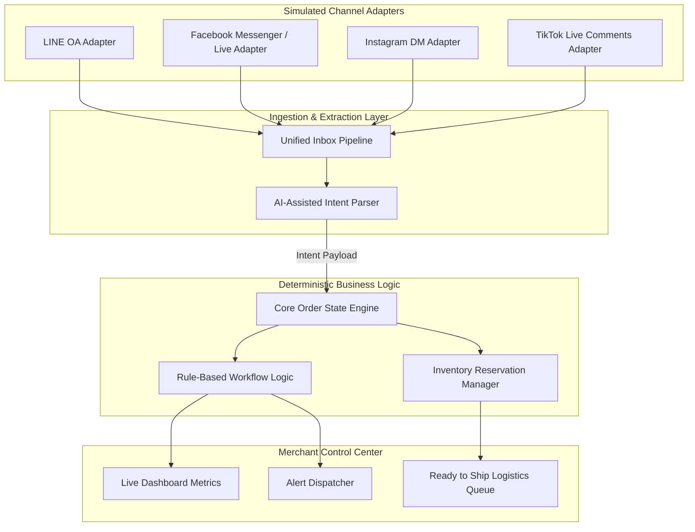

# System Architecture: OrderFlow Admin OS

This document covers the architectural layout, modules, and core flow pipelines designed for **OrderFlow Admin OS**.

---

## 1. Architectural Blueprint

The application follows a decoupled multi-layer system design to keep adapters separate from core order management pipelines:

---

## 2. Core Modules

### 2.1 Channel Adapter Layer
* **Role**: Normalizes incoming channel-specific payloads (e.g., Facebook Live comments, LINE text messages) into a uniform `IncomingMessage` schema.
* **Sprint 0A Status**: Decoupled signatures defined. Simulated payloads are directly loaded into the database mocks.

### 2.2 Unified Inbox & NLP Intent Parser
* **Role**: Parses message text to determine intent (`product_inquiry`, `order`, `variant_answer`, `payment_slip`, `address`).
* **AI Boundaries**: The NLP parser suggests *parameters* (e.g. parsed size, parsed slip reference). It has **no permission** to write status codes or modify inventory.

### 2.3 Core Order & State Engine
* **Role**: A deterministic finite state machine handling the order flow (simulated in Sprint 0A):
  `draft` ➔ `waiting_variant` ➔ `confirmed` ➔ `reserved_waiting_payment` ➔ `paid_waiting_address` ➔ `ready_to_ship` ➔ `shipped` ➔ `completed`

### 2.4 Payment Verification Boundary
* **Role**: Future integration-ready boundary that is simulated in Sprint 0A. In production, matches incoming slips against bank QR transactions.
* **Rules (Simulated)**: If a duplicate reference is detected, status shifts to `duplicate_slip` and shifts the order to `issue`. If the amount is lower than expected, status shifts to `amount_mismatch` and triggers an `issue` case.

### 2.5 Live Dashboard & Notification Center
* **Role**: Simulated in Sprint 0A. Aggregates local mock sales statistics and dispatches simulated alerts (e.g., low stock alerts, mismatch notifications).
* **Modes (Simulated)**: Supports mode-based filtering (`off`, `important_only`, `all`, `live_sale_mode`) to reduce alert fatigue.
