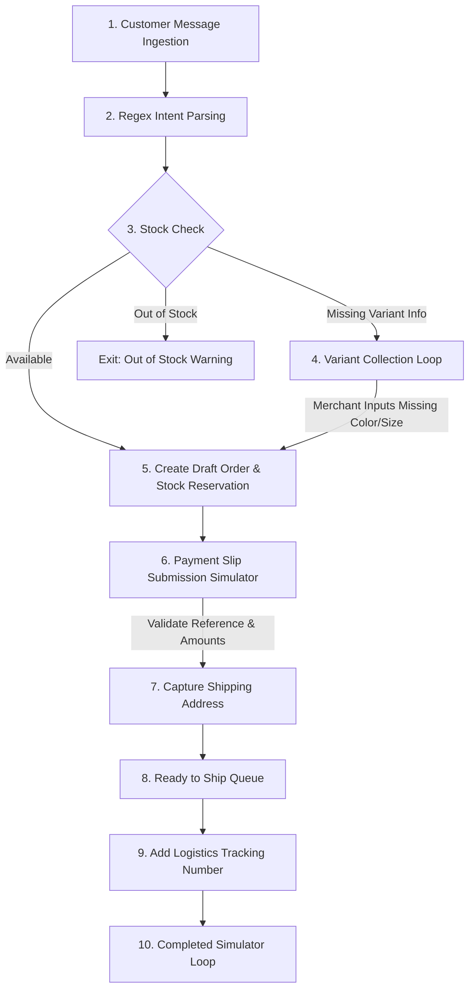

# Sprint 0B Plan: Core Order Lifecycle Simulator

This document outlines the scope, user flow, state machine logic, mock-only boundaries, and acceptance criteria for Sprint 0B: Core Order Lifecycle Simulator.

## 1. Scope
Sprint 0B introduces an interactive, step-by-step simulator interface at `/simulator` that allows visitors/reviewers to mock the entire 24/7 omni-channel sales pipeline.

* **Omni-channel message intake mockups**: Select channels and incoming customer messages.
* **Intent detection regex matching**: Parse code, variants, and quantities.
* **Simulated stock buffer reservation**: Reserve catalog products.
* **Simulated slip scanner**: Confirm payments using fake transaction codes.
* **Logistics updates**: Enter mock tracking codes and move orders to `ready_to_ship`.
* **State sync**: Connect simulation states to `/dashboard`, `/orders`, and `/notifications` using browser `localStorage` state.

## 2. Non-Goals & Mock-Only Boundaries
* No real database connection (all state is stored in browser `localStorage`).
* No LINE OA, Facebook Messenger, Facebook Live, Instagram, or TikTok API integrations.
* No SlipOK banking OCR API integration.
* No OpenAI/Gemini parser endpoints.
* No authentication, multi-tenant locks, or active payment systems.

## 3. Order Lifecycle User Flow

## 4. Acceptance Criteria
* `/simulator` page exists and enables step-by-step simulations.
* System matches product code (e.g. `ELE-001`) and variant size/color from raw messages.
* Out-of-stock messages suggest alternative products.
* Dashboard metrics calculate values dynamically from unified lists (base mocks + simulator local storage).
* In-app notifications center registers order progression alerts.
* Project compiles without TypeScript errors.
