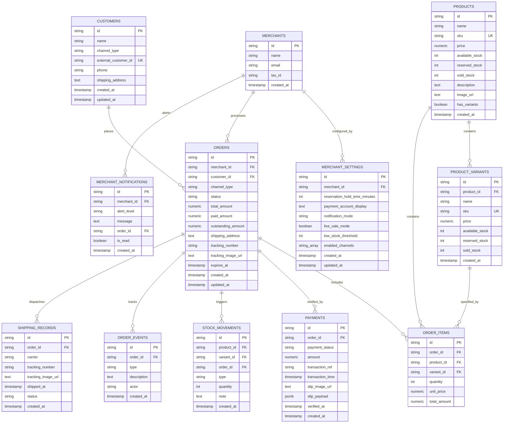

# Entity Relationship Diagram (ERD)

This document provides a relational visual mapping of the PostgreSQL tables.

```mermaid
erDiagram
    MERCHANTS ||--o{ MERCHANT_SETTINGS : configured_by
    MERCHANTS ||--o{ ORDERS : processes
    MERCHANTS ||--o{ MERCHANT_NOTIFICATIONS : alerts
    CUSTOMERS ||--o{ ORDERS : places
    PRODUCTS ||--o{ PRODUCT_VARIANTS : contains
    PRODUCTS ||--o{ ORDER_ITEMS : contains
    PRODUCT_VARIANTS ||--o{ ORDER_ITEMS : specified_by
    ORDERS ||--o{ ORDER_ITEMS : includes
    ORDERS ||--o{ PAYMENTS : verified_by
    ORDERS ||--o{ STOCK_MOVEMENTS : triggers
    ORDERS ||--o{ ORDER_EVENTS : tracks
    ORDERS ||--o{ SHIPPING_RECORDS : dispatches

    MERCHANTS {
        string id PK
        string name
        string email
        string tax_id
        timestamp created_at
    }

    MERCHANT_SETTINGS {
        string id PK
        string merchant_id FK
        int reservation_hold_time_minutes
        text payment_account_display
        string notification_mode
        boolean live_sale_mode
        int low_stock_threshold
        string_array enabled_channels
        timestamp created_at
        timestamp updated_at
    }

    CUSTOMERS {
        string id PK
        string name
        string channel_type
        string external_customer_id UK
        string phone
        text shipping_address
        timestamp created_at
        timestamp updated_at
    }

    PRODUCTS {
        string id PK
        string name
        string sku UK
        numeric price
        int available_stock
        int reserved_stock
        int sold_stock
        text description
        text image_url
        boolean has_variants
        timestamp created_at
    }

    PRODUCT_VARIANTS {
        string id PK
        string product_id FK
        string name
        string sku UK
        numeric price
        int available_stock
        int reserved_stock
        int sold_stock
        timestamp created_at
    }

    ORDERS {
        string id PK
        string merchant_id FK
        string customer_id FK
        string channel_type
        string status
        numeric total_amount
        numeric paid_amount
        numeric outstanding_amount
        text shipping_address
        string tracking_number
        text tracking_image_url
        timestamp expires_at
        timestamp created_at
        timestamp updated_at
    }

    ORDER_ITEMS {
        string id PK
        string order_id FK
        string product_id FK
        string variant_id FK
        int quantity
        numeric unit_price
        numeric total_amount
    }

    PAYMENTS {
        string id PK
        string order_id FK
        string payment_status
        numeric amount
        string transaction_ref
        timestamp transaction_time
        text slip_image_url
        jsonb slip_payload
        timestamp verified_at
        timestamp created_at
    }

    STOCK_MOVEMENTS {
        string id PK
        string product_id FK
        string variant_id FK
        string order_id FK
        string type
        int quantity
        text note
        timestamp created_at
    }

    ORDER_EVENTS {
        string id PK
        string order_id FK
        string type
        text description
        string actor
        timestamp created_at
    }

    MERCHANT_NOTIFICATIONS {
        string id PK
        string merchant_id FK
        string alert_level
        text message
        string order_id FK
        boolean is_read
        timestamp created_at
    }

    SHIPPING_RECORDS {
        string id PK
        string order_id FK
        string carrier
        string tracking_number
        text tracking_image_url
        timestamp shipped_at
        string status
        timestamp created_at
    }
```
